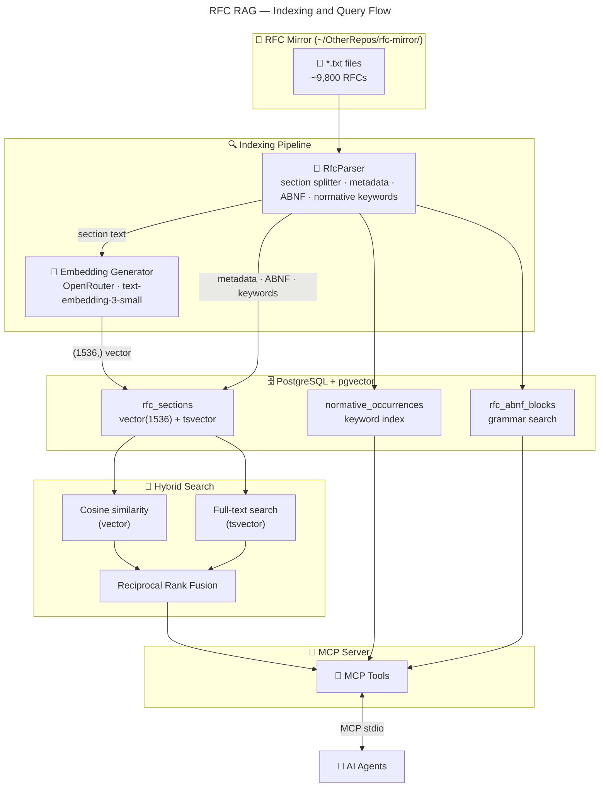

# 📡 RFC RAG

**Local RAG MCP server for RFCs: semantic search with section-level precision.**

> **Ask RFCs, get answers:**
>
> Semantic search finds relevant RFCs.  
> Full-text search catches exact keywords.  
> Section-level retrieval returns the precise paragraph, not the whole document.  
> AI agents cite RFCs without copying 200 pages of spec.  

</br>

[](https://github.com/mirusser/rfc-rag/actions/workflows/ci.yml)
[](LICENSE)
<br>

<sub>    </sub>

## 📝 TL;DR

**Index ~9,800 RFCs locally with pgvector + PostgreSQL full-text search, then query them from Claude Code or Codex (or any MCP compatible client) via MCP tools.**   

Semantic search understands meaning, full-text catches exact terms, and hybrid retrieval (RRF) combines both. Section-level indexing means you get the relevant paragraph, not a 200-page PDF.

Indexing takes ~10–15 minutes on first run. Incremental runs skip already-indexed files (SHA256-based) and complete in seconds.

### Why?

RFCs are the backbone of internet standards, but finding the right section in the right RFC is painful. CTRL+F across 9,800 text files works poorly when you don't know the exact term. Semantic search understands that "how to structure JSON Web Tokens" means RFC 7519, even if the word "structure" never appears.

The real gap is in compliance auditing. Say you're a security engineer who needs to find **every RFC section about encryption that prohibits something**. You have three bad options:

1. **Read all ~9,800 RFCs** — impossible.
2. **CTRL+F for "MUST NOT"** — 682,664 results, most about unrelated topics.
3. **Semantic search for "encryption prohibition"** — finds relevant sections, but many don't actually contain a formal prohibition. You're still guessing which are binding requirements vs. casual discussion.

This repo combines both: semantic search finds the *topic*, normative keyword filtering keeps only sections with RFC 2119/8174 requirement-level keywords (MUST, SHOULD, MUST NOT, etc.). The result is precise, citeable sections — you know exactly which RFC, which section, and which keyword makes it a binding requirement.

## 🗺️ Architecture



The parser extracts sections, metadata, normative keywords, and ABNF grammar blocks from RFC text files. Section text is embedded via OpenRouter (`text-embedding-3-small`, 1536-dim) and stored alongside `tsvector` for full-text search. Hybrid search fuses vector cosine similarity with lexical full-text scores using Reciprocal Rank Fusion (RRF). A separate MCP stdio server exposes 10 tools for AI agents.

## ⚡ Quick Start

### 🐳 Docker Compose

```bash
cp deploy/compose/rfc-rag.env.example .env.rfc-rag
# edit .env.rfc-rag
make quickstart
```

Or directly:

```bash
docker compose --env-file .env.rfc-rag -f deploy/compose/rfc-rag.yaml up
```

Full configuration guide: [configuration.md](/docs/configuration.md)


## 🧰 MCP Tools

### 🔎 Search & Retrieval

| Tool | Purpose |
|---|---|
| `search_rfc` | Hybrid search (vector + full-text) with RRF fusion. Supports `normative_keyword` filtering. |
| `get_rfc` | RFC metadata, table of contents, and section preview |
| `get_rfc_section` | Specific section with child expansion for nested subsections |
| `get_rfc_toc` | Table of contents as `section → heading` map |
| `get_rfc_metadata` | Single RFC metadata lookup (title, authors, date, status) |

### 📊 Analysis

| Tool | Purpose |
|---|---|
| `search_normative` | Search normative keywords (MUST, SHOULD, MUST NOT, SHALL, etc.) across all RFCs. See [docs/normative-search.md](docs/normative-search.md) for how normative keyword extraction and filtering work under the hood. |
| `search_abnf` | Search extracted ABNF grammar definitions |
| `find_updates_obsoletes` | Back-reference lookup — find RFCs that update or obsolete a given RFC |
| `rfc_stats` | Indexed corpus statistics (total RFCs, sections, keywords, embeddings) |
| `list_indexed_rfcs` | Paginated list of indexed RFCs with metadata |

Full tool documentation in [src/RfcRag/README.md](src/RfcRag/README.md).

## 💻 CLI Mode

Pass `--cli <verb> [args]` to run a one-shot query against an indexed database instead of starting the MCP server. All output is JSON on stdout.

Full CLI mode guide: [cli-mode-guide.md](/docs/cli-mode-guide.md)

## ⌨️ Connecting AI Agents

### Claude Code

```bash
claude mcp add-json --scope user rfc-rag \
  '{"type":"stdio","command":"dotnet","args":["run","--project","src/RfcRag/"]}'
```

### Codex

```toml
# ~/.codex/config.toml
[mcp_servers.rfc-rag]
command = "dotnet"
args = ["run", "--project", "src/RfcRag/"]
```

### Containerized MCP

> [!NOTE]
> Run the server in Docker, then connect via `docker exec`.

```bash
claude mcp add-json --scope user rfc-rag \
  '{"type":"stdio","command":"docker","args":["exec","-i","rfc-rag-rfc-rag-1","dotnet","RfcRag.dll"]}'
```

## 🗄️ Database Schema

```
rfc_rag.rfc_sections           — primary search unit (vectors + FTS)
rfc_rag.indexed_rfcs           — SHA256 tracking for incremental indexing
rfc_rag.rfc_abnf_blocks        — extracted ABNF grammar blocks
rfc_rag.normative_occurrences  — pre-extracted normative keywords
rfc_rag.schema_migrations      — applied migration tracking
```

## 🧪 Running Tests

```bash
# All tests (unit + integration)
make test

# Unit tests only (no dependencies)
dotnet test --filter "Category!=Integration"

# Integration tests (requires Docker)
dotnet test --filter "Category=Integration"

# Retrieval quality suite — indexes TestData corpus and asserts top-10 hit rate (requires Docker)
dotnet test tests/RfcRag.Tests/ --filter "Category=RetrievalQuality"
```

## 🧩 Compatibility

| Area | Supported / tested |
|---|---|
| .NET | .NET 10 |
| PostgreSQL | 15+ with pgvector 0.5+ |
| MCP transport | stdio (ModelContextProtocol 1.3.0) |
| Embeddings | OpenRouter (`text-embedding-3-small`, 1536-dim) |
| Platforms | linux/amd64, linux/arm64 |
| Docker | Compose v2, standalone |

## 🧭 Project Map

- MCP tool contracts and verification: [src/RfcRag/README.md](src/RfcRag/README.md)
- Normative search internals: [docs/normative-search.md](docs/normative-search.md)
- Test structure and conventions: [tests/RfcRag.Tests/README.md](tests/RfcRag.Tests/README.md)
- CI/CD workflow: [`.github/workflows/ci.yml`](.github/workflows/ci.yml)
- Release process: [docs/releasing.md](docs/releasing.md)
- Production deployment: [`deploy/compose/rfc-rag.yaml`](deploy/compose/rfc-rag.yaml)
- Developer commands: [`Makefile`](Makefile)

## ⚖️ Boundaries

> [!IMPORTANT]
> - Indexes a local RFC mirror — does not fetch RFCs from the internet at query time.  
> - Embeddings are generated via OpenRouter API (requires internet during indexing).  
> - MCP transport is stdio-only — no HTTP endpoint exposed.  
> - The RAG pipeline answers from indexed RFC content; it does not perform live web search or access external knowledge bases.  
> - This is a local development and research tool, not a production-certified service.  

## 📜 Governance

- License: [Apache-2.0](LICENSE)
- Security policy: [SECURITY.md](SECURITY.md)
- Contributing guide: [CONTRIBUTING.md](CONTRIBUTING.md)
- Changelog: [CHANGELOG.md](CHANGELOG.md)

---

<p align="center">
  <sub><em>Built with ❤️, ☕ and a lot of RFCs 📡✨</em></sub>
</p>
